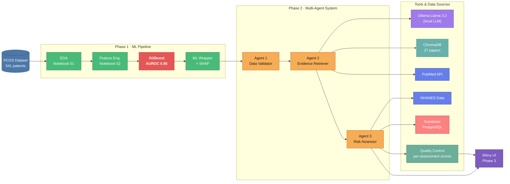

# PCOSense: Multi-Agent System for Polycystic Ovary Syndrome Detection

> AI-powered PCOS screening tool using a multi-agent architecture, local LLM, and explainable ML.

---

## Overview

PCOSense is a full-stack clinical decision-support application that estimates PCOS risk from patient biomarkers. It combines:

- **XGBoost ML model** trained on 541 labeled patient records — **AUROC 0.9528**
- **SHAP explainability** — shows which biomarkers drive each individual prediction
- **Multi-agent AI system** — 3 specialised agents orchestrated sequentially
- **RAG knowledge base** — 27 clinical papers in ChromaDB for evidence retrieval
- **Ollama + Llama 3.2** — local LLM, zero API cost, runs entirely on your machine
- **PubMed API + NHANES data** — latest research and population-level context
- **Quality Control system** — per-assessment validation scores surfaced in the UI
- **Supabase** — patient session storage, predictions, and audit trail

---

## Tech Stack

| Layer | Technology |
|-------|-----------|
| Frontend | Python Shiny |
| Backend | FastAPI + Uvicorn |
| ML Model | XGBoost + SHAP |
| LLM | Ollama · Llama 3.2 (local) |
| Vector DB | ChromaDB (RAG — 27 clinical papers) |
| Database | Supabase (PostgreSQL) |
| APIs | PubMed E-Utilities · NHANES population data |
| Data | Kaggle PCOS Dataset (541 records, 42 features) |

---

## System Architecture



> See [`docs/multi_agent_architecture.md`](docs/multi_agent_architecture.md) for detailed Mermaid diagrams of the agent workflow, tool calling map, and RAG pipeline.

---

## Multi-Agent Workflow

```
Patient Data (from user input)
    │
    ▼
Agent 1: Data Validator
    ├─ Tool: Ollama Llama 3.2 (consistency reasoning)
    ├─ Programmatic range & completeness checks
    └─ Output: {status, validated_data, flags, confidence_score}
    │
    ▼
Agent 2: Clinical Evidence Retriever
    ├─ Tool 1: ChromaDB (search 27 local clinical papers)
    ├─ Tool 2: PubMed API (fetch latest PCOS research)
    ├─ Tool 3: Ollama Embeddings (vectorise queries)
    ├─ Tool 4: Ollama Llama 3.2 (synthesise evidence)
    └─ Output: {papers[], clinical_summary, diagnostic_criteria}
    │
    ▼
Agent 3: Risk Assessor
    ├─ Tool 1: XGBoost model (predict risk 0–1)
    ├─ Tool 2: SHAP TreeExplainer (feature contributions)
    ├─ Tool 3: NHANES data (population percentiles)
    ├─ Tool 4: Ollama Llama 3.2 (synthesise recommendation)
    └─ Output: {risk_score, top_factors[], recommendation}
    │
    ▼
Quality Control (per-assessment scores surfaced in UI)
    │
    ▼
Supabase (persist results + audit trail)
```

---

## ML Model Results

| Metric | Value |
|--------|-------|
| Algorithm | XGBoost Classifier |
| Dataset | 541 patients · 45 raw features |
| Engineered features | 42 (incl. LH/FSH ratio, follicle composites) |
| Training samples | 432 (80% stratified split) |
| Test samples | 109 (20% stratified split) |
| **AUROC** | **0.9528** |
| Explainability | SHAP TreeExplainer |
| Threshold | Youden's J statistic (0.2212) |
| Inference time | < 50 ms per patient |

**Top predictive features (by SHAP):**
- Morphological: follicle count L/R, follicle total
- Symptoms: hair growth, weight gain, skin darkening, pimples
- Hormonal: LH/FSH ratio, TSH
- Cycle: regularity, length
- Metabolic: BMI, RBS

---

## Project Structure

```
PCOSense/
├── notebooks/
│   ├── 01_eda.ipynb                  EDA — distributions, correlations
│   ├── 02_features.ipynb             Feature engineering — 42 features
│   ├── 03_xgboost_training.ipynb     Training — AUROC 0.9528
│   └── 04_rag_setup.ipynb            ChromaDB knowledge base (27 papers)
├── src/
│   ├── agents.py                     3 agents + orchestrator
│   ├── ml_model.py                   XGBoost prediction + SHAP explainer
│   ├── ollama_client.py              Ollama LLM wrapper (generate + embed)
│   ├── rag_system.py                 Chroma retrieval + Ollama synthesis
│   ├── data_fetcher.py               PubMed API + NHANES baselines
│   ├── database.py                   Supabase client (patients, predictions, audit)
│   ├── quality_control.py            Per-assessment QC scores + validation flags
│   ├── api/
│   │   ├── main.py                   FastAPI — /assess, /health, /feature-info, /quality-summary
│   │   └── schemas.py                Request validation + field mapping
│   └── app/
│       └── app.py                    Shiny frontend — form + results dashboard
├── models/
│   ├── pcos_model.json               Trained XGBoost model
│   └── model_metadata.json           AUROC, features, SHAP rankings
├── data/
│   ├── raw/                          PCOS_data_without_infertility.xlsx
│   └── processed/
│       ├── features_processed.pkl    Train/test splits + scaler + imputer
│       └── eda_meta.json             EDA summary metadata
├── knowledge_base/
│   └── chroma_db/                    ChromaDB vector database
├── docs/
│   └── multi_agent_architecture.md   Mermaid agent workflow diagrams
├── .env.example                      Environment variable template
├── requirements.txt
├── .gitignore
└── README.md
```

---

## Quickstart

### Prerequisites

- Python 3.12
- [Ollama](https://ollama.ai/download) installed and running
- [Supabase](https://supabase.com) project (free tier) — optional, pipeline runs without it
- [Kaggle API token](https://www.kaggle.com/settings) — only needed if you want to retrain the model

### 1 — Clone & set up environment

```bash
git clone https://github.com/Kadambari-mirashi/PCOSense.git
cd PCOSense

python3.12 -m venv .venv
source .venv/bin/activate        # Windows: .venv\Scripts\activate

pip install --upgrade pip
pip install -r requirements.txt
```

### 2 — Install Ollama & pull models

```bash
# Install Ollama from https://ollama.ai/download, then:
ollama pull llama3.2
ollama pull nomic-embed-text
```

### 3 — Configure environment variables

```bash
cp .env.example .env
# Edit .env — set SUPABASE_URL and SUPABASE_KEY if using persistence
# CORS_ORIGINS defaults to localhost:3838; set it for any other deployment
```

### 4 — Set up Supabase tables (skip if not using persistence)

Run this SQL in your [Supabase SQL Editor](https://supabase.com/dashboard):

```sql
CREATE TABLE IF NOT EXISTS patients (
    id            UUID DEFAULT gen_random_uuid() PRIMARY KEY,
    created_at    TIMESTAMPTZ DEFAULT now(),
    age           REAL,
    bmi           REAL,
    blood_group   TEXT,
    cycle_regular BOOLEAN,
    symptoms      JSONB DEFAULT '{}',
    hormones      JSONB DEFAULT '{}',
    raw_input     JSONB DEFAULT '{}'
);

CREATE TABLE IF NOT EXISTS predictions (
    id              UUID DEFAULT gen_random_uuid() PRIMARY KEY,
    patient_id      UUID REFERENCES patients(id),
    created_at      TIMESTAMPTZ DEFAULT now(),
    risk_score      REAL NOT NULL,
    risk_label      TEXT NOT NULL,
    confidence      REAL,
    top_factors     JSONB DEFAULT '[]',
    clinical_summary TEXT,
    recommendation  TEXT,
    model_version   TEXT DEFAULT 'xgboost-v1',
    agent_outputs   JSONB DEFAULT '{}'
);

CREATE TABLE IF NOT EXISTS audit_log (
    id          UUID DEFAULT gen_random_uuid() PRIMARY KEY,
    created_at  TIMESTAMPTZ DEFAULT now(),
    patient_id  UUID REFERENCES patients(id),
    event       TEXT NOT NULL,
    details     JSONB DEFAULT '{}'
);
```

### 5 — Build the knowledge base

```bash
jupyter notebook notebooks/04_rag_setup.ipynb
# Run all cells — creates knowledge_base/chroma_db/
```

The trained model (`models/pcos_model.json`) is already committed. Run notebooks 01–03 only if you want to retrain from scratch.

### 6 — Verify everything works

```bash
python src/ml_model.py       # Test ML model
python src/ollama_client.py  # Test Ollama connection
python src/agents.py         # Test full multi-agent pipeline
```

### 7 — Run the API

```bash
uvicorn src.api.main:app --reload --host 127.0.0.1 --port 8000
```

| Endpoint | Description |
|----------|-------------|
| `GET /api/v1/health` | Service status |
| `POST /api/v1/assess` | Run full assessment pipeline |
| `GET /api/v1/feature-info` | Model metadata |
| `GET /api/v1/quality-summary` | Aggregate QC metrics across all assessments |
| `GET /docs` | OpenAPI interactive docs |

**Assessment request keys:** `age`, `bmi`, `cycle_ri` (1=regular, 2=irregular), `lh`, `fsh`, `tsh`, `hair_growth`, `skin_darkening`, `pimples`, `weight_gain`, `follicle_l`, `follicle_r`, `cycle_length_days`

### 8 — Run the Shiny frontend

In a second terminal (API must already be running):

```bash
shiny run src/app/app.py --reload --host 127.0.0.1 --port 3838
```

Open [http://127.0.0.1:3838](http://127.0.0.1:3838).

---

## Quality Control

Each assessment generates a `QCMetrics` report with four components:

| Component | Weight | What it measures |
|-----------|--------|-----------------|
| Input validation | 20% | Completeness and plausibility of patient data |
| Model confidence | 50% | XGBoost prediction strength |
| Plausibility | 20% | Joint model confidence × input quality |
| RAG evidence | 10% | Quality of retrieved clinical literature |

The overall score and individual checks are displayed in the results dashboard. The `/api/v1/quality-summary` endpoint exposes aggregate metrics across all sessions.

---

## Important Notes

- `.env` is never committed — contains Supabase credentials
- `kaggle.json` is never committed — only needed to download raw training data
- `models/pcos_model.json` is committed — no retraining needed to run the app
- All LLM inference runs locally via Ollama — zero API costs
- PubMed and NHANES APIs are public and require no authentication
- The app runs fully offline after initial setup, except for live PubMed queries
- For non-localhost deployments, set `CORS_ORIGINS` in `.env` to your frontend URL
