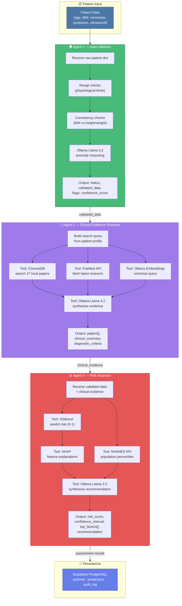
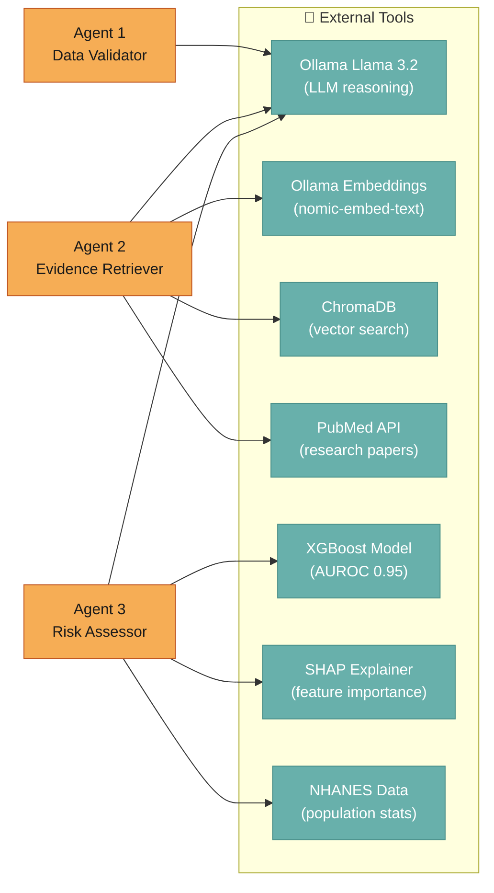
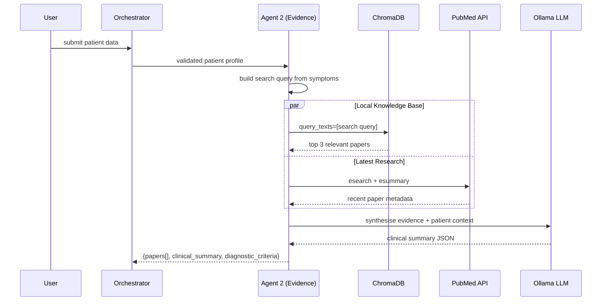
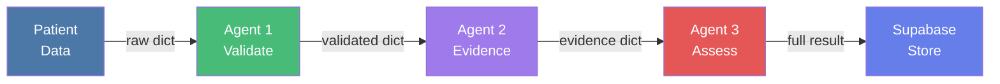

# PCOSense — Multi-Agent Architecture

## System Overview

```mermaid
flowchart TB
    subgraph INPUT["📋 Patient Input"]
        PATIENT["Patient Data<br/>(age, BMI, hormones,<br/>symptoms, ultrasound)"]
    end

    subgraph AGENT1["🛡️ Agent 1 — Data Validator"]
        direction TB
        V_IN["Receive raw patient dict"]
        V_RANGE["Range checks<br/>(physiological limits)"]
        V_CONSIST["Consistency checks<br/>(BMI vs height/weight)"]
        V_LLM["Ollama Llama 3.2<br/>anomaly reasoning"]
        V_OUT["Output: status, validated_data,<br/>flags, confidence_score"]

        V_IN --> V_RANGE --> V_CONSIST --> V_LLM --> V_OUT
    end

    subgraph AGENT2["🔬 Agent 2 — Clinical Evidence Retriever"]
        direction TB
        E_IN["Build search query<br/>from patient profile"]
        E_CHROMA["Tool: ChromaDB<br/>search 27 local papers"]
        E_PUBMED["Tool: PubMed API<br/>fetch latest research"]
        E_EMBED["Tool: Ollama Embeddings<br/>vectorise query"]
        E_SYNTH["Tool: Ollama Llama 3.2<br/>synthesise evidence"]
        E_OUT["Output: papers[],<br/>clinical_summary,<br/>diagnostic_criteria"]

        E_IN --> E_CHROMA
        E_IN --> E_PUBMED
        E_IN --> E_EMBED
        E_CHROMA --> E_SYNTH
        E_PUBMED --> E_SYNTH
        E_EMBED --> E_SYNTH
        E_SYNTH --> E_OUT
    end

    subgraph AGENT3["📊 Agent 3 — Risk Assessor"]
        direction TB
        R_IN["Receive validated data<br/>+ clinical evidence"]
        R_XGBOOST["Tool: XGBoost<br/>predict risk (0-1)"]
        R_SHAP["Tool: SHAP<br/>feature explanations"]
        R_NHANES["Tool: NHANES API<br/>population percentiles"]
        R_LLM["Tool: Ollama Llama 3.2<br/>synthesise recommendation"]
        R_OUT["Output: risk_score,<br/>confidence_interval,<br/>top_factors[],<br/>recommendation"]

        R_IN --> R_XGBOOST
        R_IN --> R_NHANES
        R_XGBOOST --> R_SHAP
        R_SHAP --> R_LLM
        R_NHANES --> R_LLM
        R_LLM --> R_OUT
    end

    subgraph STORE["💾 Persistence"]
        SUPA["Supabase PostgreSQL<br/>patients · predictions · audit_log"]
    end

    PATIENT --> AGENT1
    AGENT1 -- "validated_data" --> AGENT2
    AGENT2 -- "clinical_evidence" --> AGENT3
    AGENT3 -- "assessment results" --> STORE

    classDef input   fill:#4C78A8,stroke:#2c5282,color:#fff
    classDef agent1  fill:#48bb78,stroke:#276749,color:#fff
    classDef agent2  fill:#9f7aea,stroke:#6b46c1,color:#fff
    classDef agent3  fill:#E45756,stroke:#c53030,color:#fff
    classDef store   fill:#667eea,stroke:#434190,color:#fff

    class PATIENT input
    class AGENT1 agent1
    class AGENT2 agent2
    class AGENT3 agent3
    class SUPA store
```

---

## Tool Calling Map

```mermaid
flowchart LR
    subgraph TOOLS["🔧 External Tools"]
        T1["Ollama Llama 3.2<br/>(LLM reasoning)"]
        T2["Ollama Embeddings<br/>(nomic-embed-text)"]
        T3["ChromaDB<br/>(vector search)"]
        T4["PubMed API<br/>(research papers)"]
        T5["XGBoost Model<br/>(AUROC 0.95)"]
        T6["SHAP Explainer<br/>(feature importance)"]
        T7["NHANES Data<br/>(population stats)"]
    end

    A1["Agent 1<br/>Data Validator"] --> T1
    A2["Agent 2<br/>Evidence Retriever"] --> T1
    A2 --> T2
    A2 --> T3
    A2 --> T4
    A3["Agent 3<br/>Risk Assessor"] --> T1
    A3 --> T5
    A3 --> T6
    A3 --> T7

    classDef agent fill:#f6ad55,stroke:#c05621,color:#1a1a1a
    classDef tool  fill:#68b0ab,stroke:#4a908a,color:#fff

    class A1,A2,A3 agent
    class T1,T2,T3,T4,T5,T6,T7 tool
```

---

## RAG Pipeline Detail

```mermaid
sequenceDiagram
    participant User
    participant Orchestrator
    participant Agent2 as Agent 2 (Evidence)
    participant Chroma as ChromaDB
    participant PubMed as PubMed API
    participant Ollama as Ollama LLM

    User->>Orchestrator: submit patient data
    Orchestrator->>Agent2: validated patient profile

    Agent2->>Agent2: build search query from symptoms

    par Local Knowledge Base
        Agent2->>Chroma: query_texts=[search query]
        Chroma-->>Agent2: top 3 relevant papers
    and Latest Research
        Agent2->>PubMed: esearch + esummary
        PubMed-->>Agent2: recent paper metadata
    end

    Agent2->>Ollama: synthesise evidence + patient context
    Ollama-->>Agent2: clinical summary JSON

    Agent2-->>Orchestrator: {papers[], clinical_summary, diagnostic_criteria}
```

---

## Data Flow Summary

```mermaid
flowchart LR
    A["Patient<br/>Data"] -->|raw dict| B["Agent 1<br/>Validate"]
    B -->|validated dict| C["Agent 2<br/>Evidence"]
    C -->|evidence dict| D["Agent 3<br/>Assess"]
    D -->|full result| E["Supabase<br/>Store"]

    style A fill:#4C78A8,color:#fff
    style B fill:#48bb78,color:#fff
    style C fill:#9f7aea,color:#fff
    style D fill:#E45756,color:#fff
    style E fill:#667eea,color:#fff
```
